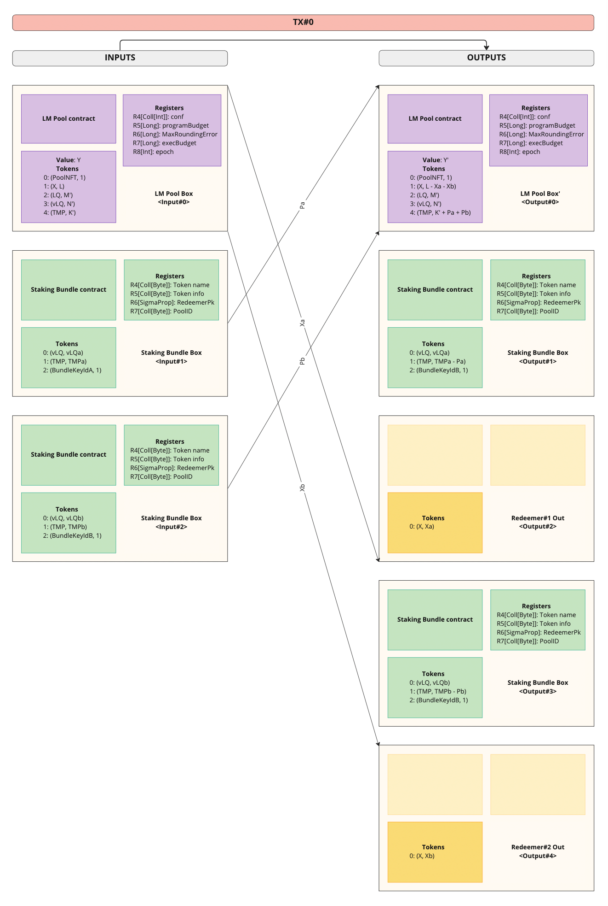

# Spectrum Finance liquidity mining protocol (Ergo)

Liqudity Mining Protocol allows anyone to set up his own liquidity mining (LM) program targeted at the desired pool on Spectrum Finance.

## Liquidity Mining Pool
Liquidity Mining (LM) Pool is represented on-chain as a UTxO with the following structure:

### Datum (LM configuration)
| Field           | Type        | Description                            |
|-----------------|-------------|----------------------------------------|
| `epochLen`      | `Integer`   | Length of one epoch in blocks          |
| `epochNum`      | `Integer`   | Number of epochs in LM program         |
| `programStart`  | `Integer`   | Block the program starts at            |
| `programBudget` | `Long`      | Total LM program budget                |
| `execBudget`    | `Long`      | Total execution budget                 |
| `epoch`         | `Int`       | Index of the epoch being compounded    |
| `minValue`      | `Long`      | Total allowable residual from rounding |

_Notes_:
* `execBudget` is not necessary for Self-Hosted LM Pool
* 
### Tokens
| Name           | Description                            |
|----------------|----------------------------------------|
| Pool ID        | An NFT to identify the pool            |
| Reward token   | Budget of the LM program               |
| LQ token       | Locked LQ tokens                       |
| vLQ token      | Tokens representing locked share of LQ |
| Temporal Token | Left program epochs times liquidity    |

## Staking bundle
Staking bundle is responsible for holding vLQ and Temporal tokens (Tmp). Staking bundle script guarantees bundling of
tokens and controls Compounding and Redeem operations (see "User scenarios" below).

### Tokens
| Name | Description                                              | Emission |
|------|----------------------------------------------------------|----------|
| Key  | Bundle key                                               | 2^63     |
| vLQ  | Virtual LQ token. Represents certain amount of liquidity |          |
| TMP  | Temporal token                                           |          |

## User scenarios

### Creator

#### Create Self-Hosted LM Pool
Bob works on a project X with a token Xt. He would like to incentivize holders of Xt to keep their tokens in ADA/Xt pools.
To do that, Bob sets parameters `epochLen` and `epochNum` and sends `L` tokens Xt to the LM script address.
Bob should configure his own Ergo-node and off-chain bots to perform transactions.

#### Create Delegated LM Pool
Bob works on a project X with a token Xt. He would like to incentivize holders of Xt to keep their tokens in ADA/Xt pools.
To do that, Bob sets parameters `epochLen` and `epochNum` sends `L` tokens X to the LM script address.
In case of Delegated LM Pool he should additionally send `Y` ERGs to the LM script address as `execBudget` for executing transactions.

#### Increase execution budget
When created, the budget will be spent linearly.
However, the exact number of ERGs needed depends on the number of program participants. 
Creator will have to monitor ERGs balance and perform additional deposits.

_Notes_:
* Deposited ERGs as `execBudget` will be spent almost completely!

### Participant

#### Deposit
Alice wants to participate in LM program X. To do that, she sends `LQa` ADA/Xt LQ tokens to LM script
address and receives bundled (see "Staking bundle" section above) `vLQa` vLQ tokens + `TMPa` temporal tokens in return,
where `vLQa` - amount of LQ tokens deposited, `LQa = vLQa`, `TMPa = (EpochNum - (Height - ProgramStart + 1)) * vLQa`

_Notes_:
* If the user wants to add more LQ tokens, a new "Staking bundle" will be released
* New "Staking bundle" can't be released until all previous epochs are compounded

#### Reward
After each epoch rewards, allocated for each epoch, are fully distributed among stakers. 
Each staker automatically receives a reward of `EpochReward * StakerLQ / LockedLQ` tokens on his wallet for each passed epoch. 
`TMPa - vLQa * (EpochNum - Epoch)` epoch token is withdrawn from Alice's staking bundle box each time compounding happens.

### Redeem
Once Alice decided to unstake her liquidity she returns her staking bundle to LM Pool and receives proportional amount of LQ tokens
to the amount of vLQ returned. Redemption is only allowed when all epochs Alice is eligible for are compounded.

_Notes_:
* User can redeem his LQ tokens before and after program end
* LQ tokens cannot be redeemed until all previous epochs are compounded
